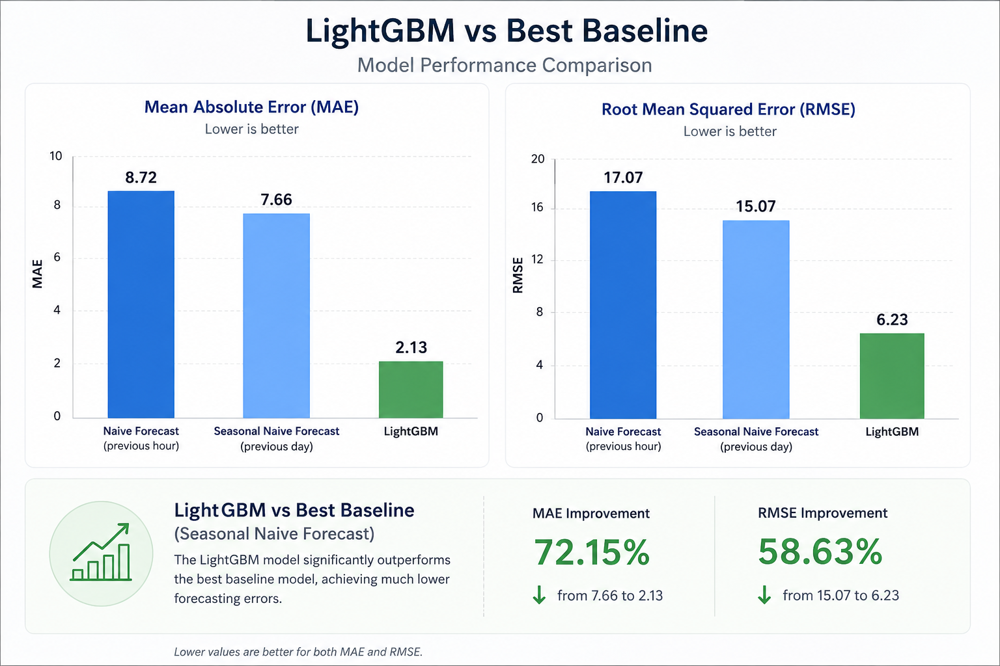

# Demand Forecasting for Retail

## Project Status

✅ Completed

---

## Business Problem

Retail companies must accurately forecast product demand to maintain optimal inventory levels.

Overestimating demand increases storage costs and product waste.

Underestimating demand leads to stock shortages, lost sales, and dissatisfied customers.

This project develops a machine learning solution to forecast hourly product demand for each product at every dark store location. The resulting forecasts can support inventory planning, purchasing decisions, and supply chain optimization.

---

## Dataset

The dataset contains historical hourly sales records together with operational and external factors, including:

- Product ID
- Store ID
- Timestamp
- Temperature
- Promotions
- Competitor prices
- Stock availability
- Local events
- Delivery delays
- Customer app activity

**Target variable**

- Sales

---

## Project Objectives

- Explore historical sales patterns
- Perform feature engineering
- Build forecasting models
- Compare model performance with baseline methods
- Generate business recommendations based on forecasting results

---

## Technologies

- Python
- Pandas
- NumPy
- Scikit-learn
- LightGBM
- Matplotlib
- Jupyter Notebook

---

## Exploratory Data Analysis

The dataset was analyzed to identify:

- Missing values
- Sales seasonality
- Daily and weekly demand patterns
- Promotion effects
- Inventory shortages
- Relationships between price and demand

---

## Feature Engineering

The following features were created:

- Hour
- Day of week
- Month
- Weekend indicator
- Price difference
- Price ratio
- Lag features (1h, 24h, 168h)
- Rolling mean (24h)
- Rolling standard deviation (24h)

---

## Model Development

The forecasting model was developed using **LightGBM**.

The preprocessing pipeline includes:

- Missing value handling
- Time-based train/test split
- Time feature extraction
- Lag features
- Rolling statistics
- Price-based features
- Stock-out (censored demand) analysis

The model was evaluated using:

- MAE (Mean Absolute Error)
- RMSE (Root Mean Squared Error)

---

## Model Comparison



---

## Results

The improved LightGBM model significantly outperformed both baseline forecasting approaches.

| Model | MAE | RMSE |
|------|----:|----:|
| Naive Forecast (previous hour) | 8.72 | 17.07 |
| Seasonal Naive Forecast (previous day) | 7.66 | 15.07 |
| **LightGBM** | **2.13** | **6.23** |

### Improvement over the best baseline

- **MAE improved by 72.15%**
- **RMSE improved by 58.63%**

These results demonstrate that feature engineering together with a robust preprocessing pipeline substantially improves demand forecasting accuracy.

---

## Business Recommendations

Based on the forecasting results, retailers can:

- Reduce stock shortages through more accurate replenishment planning.
- Decrease overstock and product waste.
- Improve purchasing decisions using reliable hourly demand forecasts.
- Optimize inventory levels across multiple dark stores.
- Support supply chain planning using data-driven demand predictions.

---

## Project Structure

```
demand-forecasting/
│
├── data/
├── dashboard/
├── images/
├── notebooks/
├── src/
│   ├── preprocessing.py
│   ├── features.py
│   └── metrics.py
│
├── README.md
├── requirements.txt
└── LICENSE
```

---

## Future Improvements

- Hyperparameter optimization
- Cross-validation for time-series forecasting
- Power BI dashboard
- Automated forecasting pipeline
- Model deployment using cloud infrastructure

---

## Author

**Elena Havrylova**

Google Cloud Professional Machine Learning Engineer

Open to Data Analyst opportunities.
