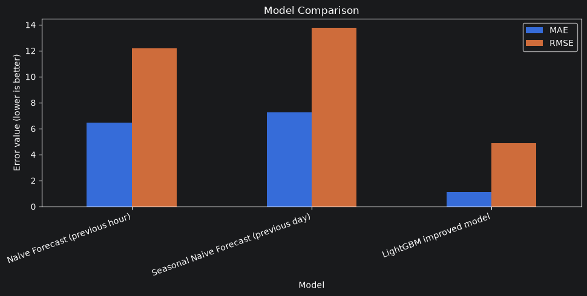
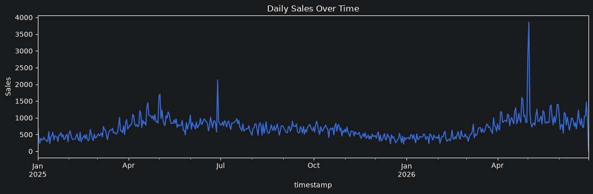
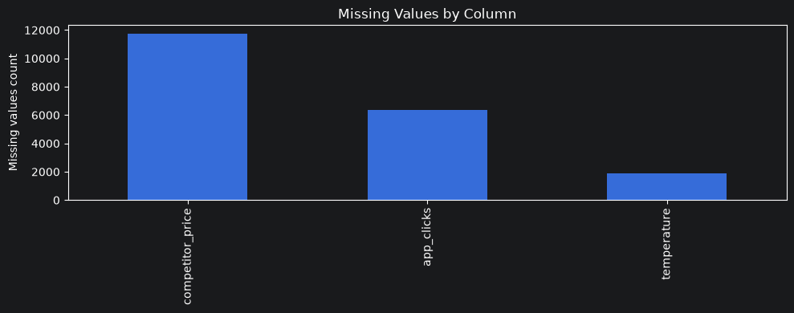

# Demand Forecasting for Retail

> Production-ready machine learning pipeline for hourly retail demand forecasting using LightGBM.

---

## Project Overview

This project was developed as a production-oriented demand forecasting solution for a dark store retail network.

The objective is to predict hourly product demand for every **Store × Product** combination while preventing time-series data leakage and supporting inventory planning.

The project includes:

- modular Python pipeline;
- feature engineering;
- stock-out (censored demand) handling;
- time-based backtesting;
- baseline comparison;
- leakage validation;
- business documentation.

---
## Project Preview

### Model Comparison



### Daily Sales



### Missing Values



## Key Results

- ✅ Leakage-safe feature engineering
- ✅ 3-month backtest
- ✅ LightGBM outperformed both naive baselines
- ✅ MAE improvement: **72.15%**
- ✅ RMSE improvement: **58.63%**
# Business Problem

Retail companies must accurately forecast future demand to maintain optimal inventory levels.

Poor forecasts create two major business risks:

### Under-forecasting

- stock shortages
- lost sales
- dissatisfied customers

### Over-forecasting

- excessive inventory
- higher storage costs
- product waste

The goal of this project is to provide reliable hourly demand forecasts for purchasing and replenishment planning.

---

# Dataset

The dataset contains historical hourly observations including:

- Product ID
- Store ID
- Timestamp
- Temperature
- Local events
- Product price
- Promotions
- Competitor price
- Delivery delay
- Holiday factor
- App clicks
- Stock on hand

Target variable:

- Sales
- Demand Proxy (after stock-out adjustment)

---

# Project Structure

```text
DemandForecasting/
│
├── data/
│   └── demand_train_val_1.5years.csv
│
├── images/
│
├── models/
│   └── archive/
│
├── notebooks/
│   └── 01_analytical_report.ipynb
│
├── reports/
│   ├── business_executive_summary.md
│   └── leakage_test_report.md
│
├── src/
│   ├── __init__.py
│   ├── data_loading.py
│   ├── preprocessing.py
│   ├── features.py
│   ├── decensoring.py
│   ├── training.py
│   ├── inference.py
│   ├── validation.py
│   └── metrics.py
│
├── requirements.txt
├── README.md
├── LICENSE
└── .gitignore
```

---

# Pipeline

```
Load Data
      │
      ▼
Schema Validation
      │
      ▼
Data Cleaning
      │
      ▼
Feature Engineering
      │
      ▼
Stock-out Detection
      │
      ▼
Demand Proxy Creation
      │
      ▼
Time-based Split
      │
      ▼
LightGBM Training
      │
      ▼
Model Evaluation
      │
      ▼
Business Report
```

---

# Feature Engineering

The model uses several feature groups.

### Time Features

- Hour
- Day of week
- Month
- Weekend indicator

### Pricing Features

- Price difference
- Price ratio

### Lag Features

- Previous hour
- Previous day
- Previous week

### Rolling Statistics

- Rolling mean
- Rolling standard deviation

All rolling statistics are calculated after **shift(1)** to avoid future leakage.

---

# Stock-out Handling

Observed sales are not always equal to real customer demand.

When

```
stock_on_hand = 0
```

customers cannot buy additional products.

The pipeline therefore:

- detects stock-out observations;
- creates `is_stockout`;
- builds a conservative `demand_proxy`;
- trains the model using adjusted demand.

---

# Model

Model:

**LightGBM Regressor**

Evaluation strategy:

- Time-based split
- 3-month backtest

Evaluation metrics:

- MAE
- RMSE

---

# Baseline Comparison

| Model | MAE | RMSE |
|------|----:|----:|
| Naive Forecast | 8.72 | 17.07 |
| Seasonal Naive Forecast | 7.66 | 15.07 |
| **LightGBM** | **2.13** | **6.23** |

### Improvement

- **MAE:** +72.15%
- **RMSE:** +58.63%

---

# Leakage Validation

The project includes a **Future Permutation Test**.

The validation confirms that:

- lag features use only historical observations;
- rolling statistics do not depend on future values;
- historical features remain unchanged after future target permutation.

Result:

✅ **Leakage Test Passed**

---

# Business Impact

The proposed solution can help retailers:

- reduce stockouts;
- reduce overstocking;
- improve purchasing decisions;
- optimize replenishment;
- improve inventory planning.

---

# Technologies

- Python
- Pandas
- NumPy
- LightGBM
- Scikit-learn
- Matplotlib
- Jupyter Notebook

---

# Reproducibility

Install dependencies:

```bash
pip install -r requirements.txt
```

Run:

```
notebooks/01_analytical_report.ipynb
```

---

# Author

**Elena Havrylova**

Google Cloud Professional Machine Learning Engineer

Open to Data Analytics / Machine Learning opportunities.