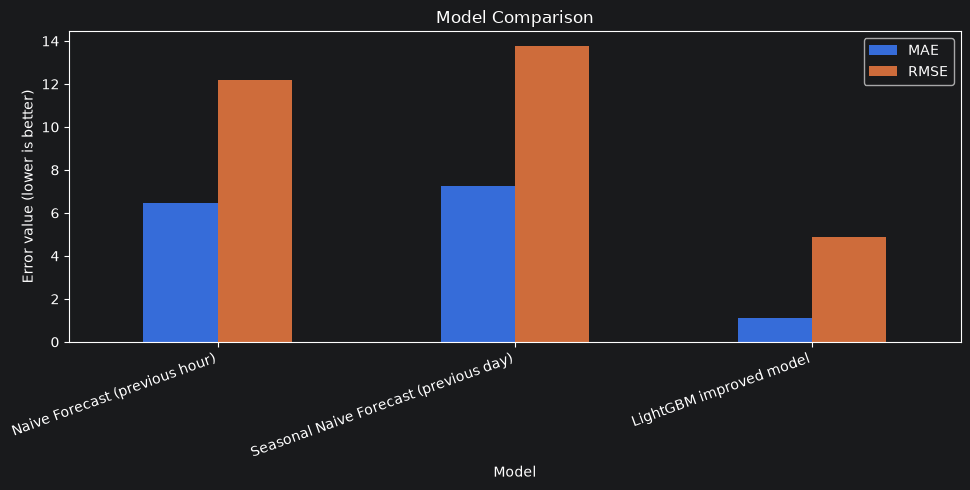
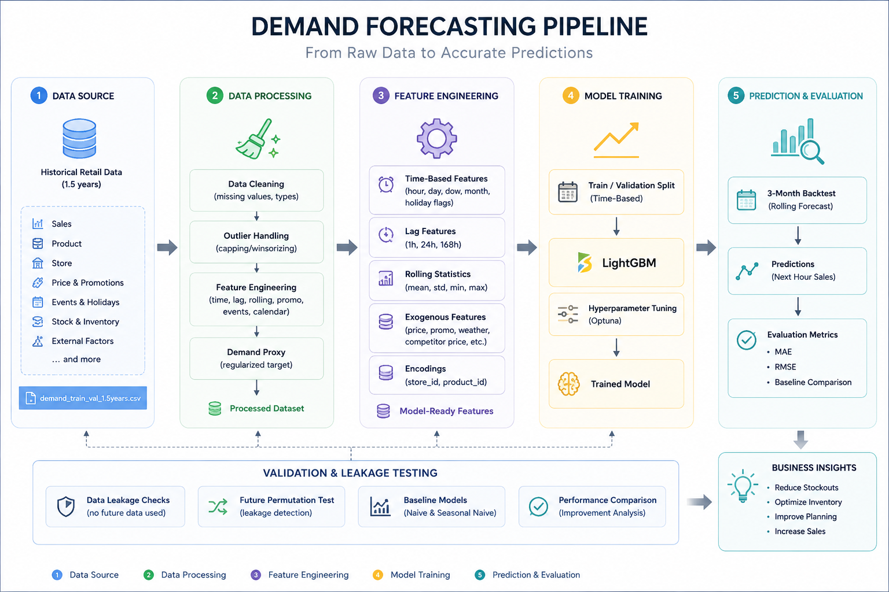
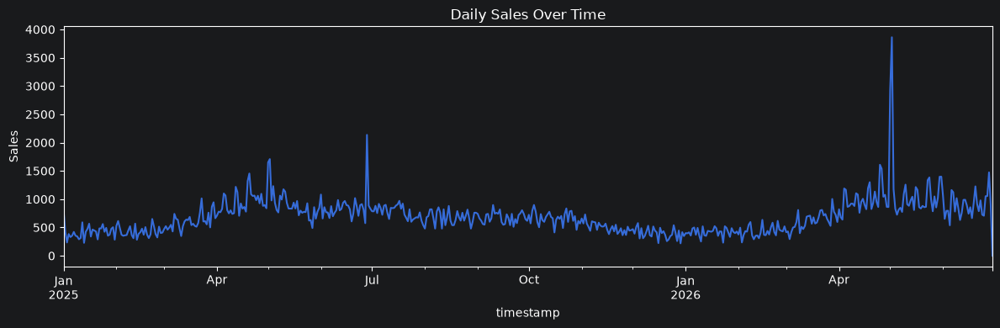
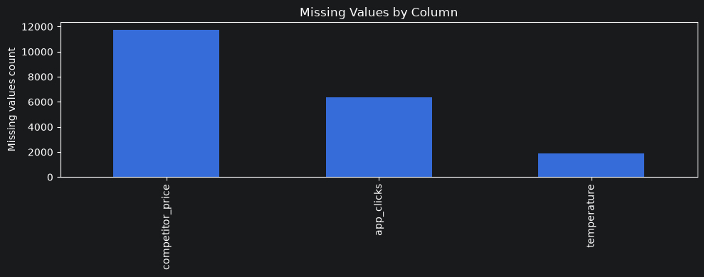

# Retail Demand Forecasting for Dark Stores

[](https://www.python.org/)
[](https://lightgbm.readthedocs.io/)
[](https://streamlit.io/)
[](https://demand-forecasting-nxky4bbby5tkusdxybtn43.streamlit.app/)

Production-ready machine learning solution for forecasting hourly retail demand at the **Product–Dark Store–Hour** level.

The project demonstrates a complete end-to-end ML workflow:

- Exploratory Data Analysis
- Feature Engineering
- Target Reconstruction
- Leakage-safe Validation
- Walk-Forward Backtesting
- Interactive Streamlit Dashboard
- Business Executive Summary

---

## 🚀 Live Interactive Dashboard

[Open the Streamlit application](https://demand-forecasting-nxky4bbby5tkusdxybtn43.streamlit.app/)

Click the dashboard preview below to open the live application.

[](https://demand-forecasting-nxky4bbby5tkusdxybtn43.streamlit.app/)

---

## Table of Contents

- [Business Problem](#business-problem)
- [Solution Overview](#solution-overview)
- [Key Achievements](#key-achievements)
- [Machine Learning Pipeline](#machine-learning-pipeline)
- [Model Results](#model-results)
- [Dashboard Features](#dashboard-features)
- [Project Preview](#project-preview)
- [Repository Structure](#repository-structure)
- [Technology Stack](#technology-stack)
- [Reproducibility](#reproducibility)
- [Business Executive Summary](#business-executive-summary)
- [Future Improvements](#future-improvements)
- [Author](#author)

---

## Business Problem

Fast grocery delivery services require accurate forecasts to maintain enough inventory in each local dark store while avoiding overstock.

Inaccurate forecasts may lead to:

- Lost sales
- Product shortages
- Excess inventory
- Product waste
- Financial losses for the retailer and suppliers

The objective is to forecast demand at the **Product–Dark Store–Hour** level for medium-term planning.

---

## Solution Overview

```text
Raw Data
   ↓
EDA and Cleaning
   ↓
Feature Engineering
   ↓
Target Reconstruction
   ↓
LightGBM Training
   ↓
Walk-Forward Backtesting
   ↓
Future Permutation Test
   ↓
Interactive Dashboard
```

---

## Key Achievements

- Built a modular production-ready ML pipeline
- Reduced MAE by **72.15%**
- Reduced RMSE by **58.63%**
- Implemented leakage-safe validation
- Developed an interactive analytics dashboard
- Delivered an end-to-end forecasting solution

---

## Machine Learning Pipeline

### Data preparation

- Schema validation
- Missing-value analysis
- Median imputation
- Time-series sorting
- Stock-out detection

### Feature engineering

- Sales lag: 1 hour
- Sales lag: 24 hours
- Sales lag: 168 hours
- Rolling mean over 24 hours
- Rolling standard deviation over 24 hours
- Calendar features
- Promotion indicators
- Weather data
- Competitor prices
- Inventory data
- Holiday and local-event factors

### Target reconstruction

Observed sales may underestimate real demand during stock-out periods. A demand proxy was created to estimate hidden demand during censored observations.

### Model

The final forecasting model is a **LightGBM Regressor**, selected because it:

- Performs well on tabular data
- Trains quickly
- Captures nonlinear relationships
- Handles mixed business features
- Outperformed the naive baselines

### Validation

The model was evaluated using:

- Time-based train/test split
- Three-month walk-forward backtest
- Future Permutation Test

The leakage test confirmed that historical lag and rolling features do not depend on future target values.

---

## Model Results

| Model | MAE | RMSE |
|---|---:|---:|
| Naive Forecast — previous hour | 8.72 | 17.07 |
| Seasonal Naive Forecast — previous day | 7.66 | 15.07 |
| **LightGBM** | **2.13** | **6.23** |

### Improvement over the best baseline

| Metric | Improvement |
|---|---:|
| MAE | **72.15%** |
| RMSE | **58.63%** |

---

## Dashboard Features

The Streamlit dashboard includes four interactive pages.

### Executive Overview

- Executive KPI cards
- Daily sales trend
- Average sales by hour
- Promotion impact
- Stock-out rate by store
- Automated business observations
- Interactive filters

### Model Performance

- Baseline comparison
- MAE and RMSE
- Improvement metrics
- Leakage-test result
- Validation explanation

### Business Insights

- Weekday demand patterns
- Temperature impact
- Competitor-price analysis
- Observed sales versus demand proxy
- Hidden-demand estimation

### About the Project

- Business objective
- Project architecture
- Main results
- Technology overview

---

## Project Preview

### Model Comparison



### Pipeline Diagram



### Daily Sales



### Missing Values



---

## Repository Structure

```text
DemandForecasting/
├── app.py
├── .streamlit/
│   └── config.toml
├── app_utils/
│   ├── charts.py
│   ├── components.py
│   ├── config.py
│   ├── filters.py
│   ├── insights.py
│   ├── loader.py
│   ├── metrics.py
│   └── theme.py
├── views/
│   ├── executive.py
│   ├── model_performance.py
│   ├── business_insights.py
│   └── about.py
├── dashboard/
│   ├── build_dashboard_dataset.py
│   └── demand_dashboard.csv
├── notebooks/
├── src/
├── models/
├── reports/
├── images/
├── requirements.txt
├── README.md
└── LICENSE
```

---

## Technology Stack

### Machine learning

- Python
- Pandas
- NumPy
- Scikit-learn
- LightGBM

### Visualization and application

- Plotly
- Streamlit
- Matplotlib

### Development

- Jupyter Notebook
- Git
- GitHub

---

## Reproducibility

Clone the repository:

```bash
git clone https://github.com/lialit/demand-forecasting.git
cd demand-forecasting
```

Install dependencies:

```bash
pip install -r requirements.txt
```

Generate the dashboard dataset:

```bash
python dashboard/build_dashboard_dataset.py
```

Launch the application:

```bash
streamlit run app.py
```

---

## Business Executive Summary

The solution combines demand reconstruction, time-aware validation and a high-performance gradient-boosting model.

Key decisions:

- Median imputation was used because it is robust to outliers.
- Stock-out periods were adjusted using a demand proxy.
- Time-based backtesting reproduced a realistic forecasting scenario.
- MAE was selected for interpretable average error.
- RMSE was used to penalize large and financially costly mistakes.
- LightGBM substantially outperformed both naive baselines.

---

## Future Improvements

Potential production enhancements:

- SHAP explainability
- MLflow experiment tracking
- Docker deployment
- GitHub Actions CI/CD
- Automated model retraining
- Data-drift detection
- Real-time forecast monitoring
- REST API for inference

---

## Author

**Olena Havrylova**

- [GitHub](https://github.com/lialit)
- [Streamlit Dashboard](https://demand-forecasting-nxky4bbby5tkusdxybtn43.streamlit.app/)