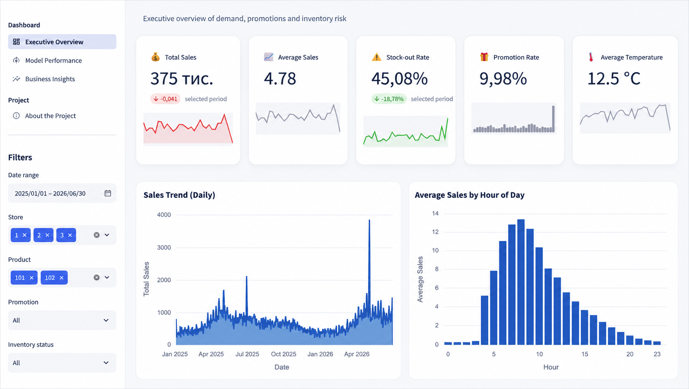

# Retail Demand Forecasting for Dark Stores

[](https://www.python.org/)
[](https://lightgbm.readthedocs.io/)
[](https://streamlit.io/)
[](https://demand-forecasting-nxky4bbby5tkusdxybtn43.streamlit.app/)

A production-oriented machine learning prototype for forecasting hourly retail demand at the **Product–Dark Store–Hour** level.

The repository demonstrates an end-to-end forecasting workflow with modular data preparation, feature engineering, a conservative demand proxy for stock-out periods, time-based validation, reproducible model artifacts and an interactive Streamlit dashboard.

> The project uses synthetic data. Results demonstrate the approach and code structure, not guaranteed production performance for a real retailer.

---

## Live Interactive Dashboard

[Open the Streamlit application](https://demand-forecasting-nxky4bbby5tkusdxybtn43.streamlit.app/)

[](https://demand-forecasting-nxky4bbby5tkusdxybtn43.streamlit.app/)

---

## Business Problem

Fast grocery delivery services need enough inventory in each local dark store to satisfy demand without creating excessive stock and waste.

Forecast errors may lead to:

- lost sales and customer dissatisfaction;
- product shortages;
- unnecessary safety stock;
- excess inventory and waste;
- inefficient purchasing and replenishment decisions.

The solution forecasts demand for each **product, dark store and hour**.

---

## Current Solution Flow

```text
Raw CSV
   ↓
Schema validation and feature-specific cleaning
   ↓
Time, price, lag and rolling features
   ↓
Conservative demand proxy for stock-out periods
   ↓
Three-month time-based holdout
   ↓
LightGBM training and baseline comparison
   ↓
MAE, RMSE and leakage check
   ↓
Model metrics and prediction artifacts
   ↓
Actual vs Predicted Streamlit dashboard
```

A detailed description of every module is available in [`docs/CURRENT_SOLUTION_GUIDE.md`](docs/CURRENT_SOLUTION_GUIDE.md).

---

## Key Results

| Model | MAE | RMSE |
|---|---:|---:|
| Naive forecast — previous hour | 8.72 | 17.07 |
| Seasonal naive forecast — previous day | 7.66 | 15.07 |
| **LightGBM** | **2.13** | **6.23** |

Compared with the best simple baseline:

- MAE was reduced by **72.15%**;
- RMSE was reduced by **58.63%**.

### Business interpretation

- **MAE 2.13** means that the model misses actual demand by about 2.13 product units on average for each evaluated store-product-hour observation.
- **RMSE 6.23** is higher because some periods contain larger errors, such as demand spikes or unusual operating conditions.
- The improvement over the baseline shows that the model adds substantial predictive value compared with simply reusing demand from the previous hour or previous day.
- These metrics describe forecast accuracy, not direct financial savings. A monetary business case requires product margin, waste cost, stock-out cost and replenishment constraints.

A good average result does not guarantee equal quality for every product or store. The dashboard therefore includes filters and local metrics for individual store-product series.

---

## Data Preparation

The preprocessing strategy is feature-specific:

- missing temperature is filled with the global median;
- missing competitor price is replaced with the retailer's own price;
- missing app clicks, holiday and delay values use neutral defaults;
- rows are sorted chronologically by store, product and timestamp;
- `is_stockout` is set when `stock_on_hand <= 0`.

This is not a universal median-imputation pipeline.

---

## Feature Engineering

The model uses:

- store and product identifiers;
- hour, weekday, month and weekend indicators;
- price difference and price ratio;
- promotion, weather, holiday and local-event factors;
- app clicks, delivery delay and stock level;
- sales lags of 1, 24 and 168 hours;
- 24-hour rolling mean and standard deviation;
- stock-out indicator.

Lag and rolling features use shifted historical sales so the current target is not used directly in its own features.

---

## Demand Proxy

Observed sales may underestimate true demand when an item is unavailable.

For stock-out observations, the project creates a conservative proxy using the greater of:

- observed sales;
- the recent 24-hour rolling mean.

This is a practical heuristic, not a guaranteed reconstruction of true hidden demand.

---

## Validation

The current modular implementation uses:

- one **three-month time-based holdout**;
- previous-hour and previous-day baselines;
- a Future Permutation Test for lag and rolling features.

The permutation test checks that changing future sales values does not alter historical lag and rolling features. It does not prove that every possible form of data leakage is absent.

The current validation is not a multi-fold walk-forward evaluation.

---

## Dashboard Features

### Executive Overview

- business KPI cards;
- daily sales trend;
- demand patterns by hour;
- promotion impact;
- stock-out rate by store;
- interactive filters.

### Model Performance

- Actual vs Predicted demand chart;
- dark-store and product filters;
- hourly or daily aggregation;
- live MAE, RMSE and forecast bias;
- business-facing explanations of overforecast and underforecast risk;
- baseline comparison;
- leakage-test result;
- model limitations and retraining guidance.

### Business Insights

- weekday demand patterns;
- temperature impact;
- competitor-price analysis;
- observed sales versus demand proxy;
- hidden-demand estimate during stock-outs.

---

## Reproducibility

Clone the repository and install dependencies:

```bash
git clone https://github.com/lialit/demand-forecasting.git
cd demand-forecasting
pip install -r requirements.txt
```

Generate model metrics and prediction artifacts:

```bash
python scripts/run_model_pipeline.py
```

This creates:

```text
artifacts/model_metrics.json
artifacts/model_predictions.csv
```

Generate the historical dashboard dataset:

```bash
python dashboard/build_dashboard_dataset.py
```

Launch the Streamlit application:

```bash
streamlit run app.py
```

---

## When to Review or Retrain the Model

A model review or retraining run should be considered when:

- MAE or RMSE increases materially against the approved baseline;
- forecast bias becomes persistently positive or negative;
- demand, prices, promotions, traffic or stock distributions change;
- new stores, products or operating regions appear;
- seasonal or customer behavior changes after campaigns or market events;
- a scheduled retraining date is reached.

Exact alert thresholds must be agreed with the client and tied to business impact. A fixed percentage such as 15–20% may be a useful initial investigation threshold, but it is not universal.

---

## Production Integration Direction

A future Google Cloud implementation could use:

- **BigQuery** for sales history, features and forecast tables;
- **Cloud Storage** for source files and model artifacts;
- **Vertex AI Training** for managed model training;
- **Vertex AI Model Registry** for model versions;
- **Vertex AI Batch Prediction** for scheduled forecasts;
- **Cloud Run** for an API or orchestration service;
- **Cloud Scheduler** for recurring forecast and retraining jobs;
- **Cloud Monitoring** for pipeline failures and model-performance alerts.

For regular inventory planning, batch prediction is likely more appropriate than a permanently running online endpoint.

---

## Current Limitations

- synthetic source data;
- one three-month holdout rather than multi-fold walk-forward validation;
- heuristic demand proxy;
- manually selected LightGBM parameters;
- limited cold-start handling;
- no automated drift monitoring or retraining pipeline;
- no production model registry, CI/CD or client-system integration yet.

---

## Repository Structure

```text
DemandForecasting/
├── app.py
├── app_utils/
│   ├── business_interpretation.py
│   ├── charts.py
│   ├── forecast_charts.py
│   ├── model_artifacts.py
│   └── ...
├── artifacts/
│   ├── model_metrics.json
│   └── model_predictions.csv
├── dashboard/
│   └── build_dashboard_dataset.py
├── docs/
│   └── CURRENT_SOLUTION_GUIDE.md
├── scripts/
│   └── run_model_pipeline.py
├── src/
│   ├── data_loading.py
│   ├── preprocessing.py
│   ├── features.py
│   ├── decensoring.py
│   ├── validation.py
│   ├── training.py
│   ├── metrics.py
│   └── inference.py
├── views/
├── notebooks/
├── requirements.txt
└── README.md
```

---

## Author

**Olena Havrylova**

- [GitHub](https://github.com/lialit)
- [Streamlit Dashboard](https://demand-forecasting-nxky4bbby5tkusdxybtn43.streamlit.app/)
