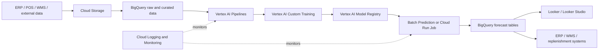

# Retail Demand Forecasting for Dark Stores

[](https://www.python.org/)
[](https://lightgbm.readthedocs.io/)
[](https://streamlit.io/)
[](https://demand-forecasting-nxky4bbby5tkusdxybtn43.streamlit.app/)

A production-oriented machine learning prototype for forecasting hourly demand at the **Product–Dark Store–Hour** level.

The project combines modular data preparation, feature engineering, a conservative demand proxy for stock-out periods, chronological validation, reproducible model artifacts and a business-oriented Streamlit dashboard.

> The project uses synthetic data. The results demonstrate the approach and code structure, not guaranteed performance for a real retailer.

## Live Dashboard

[Open the Streamlit application](https://demand-forecasting-nxky4bbby5tkusdxybtn43.streamlit.app/)

[](https://demand-forecasting-nxky4bbby5tkusdxybtn43.streamlit.app/)

## Business Problem

Express-delivery retailers need enough inventory in every dark store to satisfy demand without creating excessive stock and waste.

Forecast errors may cause lost sales, product shortages, unnecessary safety stock, excess inventory and inefficient replenishment decisions.

## End-to-End Solution


```mermaid
flowchart LR
    A[Historical CSV] --> B[Schema validation]
    B --> C[Feature-specific cleaning]
    C --> D[Time, price, lag and rolling features]
    D --> E[Conservative demand proxy]
    E --> F[Three-month time-based holdout]
    F --> G[LightGBM training]
    G --> H[Baseline comparison and leakage check]
    H --> I[Metrics and prediction artifacts]
    I --> J[Actual vs Predicted dashboard]
```

A detailed module-by-module explanation is available in [`docs/CURRENT_SOLUTION_GUIDE.md`](docs/CURRENT_SOLUTION_GUIDE.md).

## Key Results

| Model | MAE | RMSE |
|---|---:|---:|
| Naive forecast — previous hour | 8.72 | 17.07 |
| Seasonal naive forecast — previous day | 7.66 | 15.07 |
| **LightGBM** | **2.13** | **6.23** |

Compared with the best simple baseline:

- MAE was reduced by **72.15%**;
- RMSE was reduced by **58.63%**.

### Business interpretation

- **MAE 2.13** means that the forecast differs from the demand proxy by about two product units on average for one store-product-hour observation.
- **RMSE 6.23** shows that some periods contain larger misses, especially around demand spikes or unusual operating conditions.
- The improvement over the baseline demonstrates predictive value beyond simply repeating demand from the previous hour or previous day.

### Estimated business impact

The result suggests that the model can support replenishment and inventory-planning decisions by providing a substantially more accurate demand signal than simple historical rules.

- For stable and higher-volume products, an average error of about two units may be useful for operational planning.
- For low-volume products, two units may still be material, so performance should be reviewed by product and store rather than only globally.
- Underforecasting may increase stock-out and lost-sales risk.
- Overforecasting may increase excess inventory, waste and tied-up working capital.
- The model should support operational judgement rather than replace business rules and replenishment constraints.

A monetary estimate cannot be calculated responsibly from the current dataset alone. It requires product margin, waste cost, stock-out cost, service-level targets, shelf-life and replenishment constraints.

## Method

### Data preparation

- missing temperature is filled with the global median;
- missing competitor price is replaced with the retailer's own price;
- missing app clicks, holiday and delay values use neutral defaults;
- records are sorted by store, product and timestamp;
- `is_stockout` is set when `stock_on_hand <= 0`.

### Feature engineering

The model uses identifiers, calendar fields, price relationships, promotion and external factors, stock level, sales lags of 1, 24 and 168 hours, and 24-hour rolling statistics.

Lag and rolling features use shifted historical sales, preventing the current target from becoming its own feature.

### Demand proxy

During stock-out observations, the target is adjusted using the greater of observed sales and the recent 24-hour rolling mean. This is a conservative heuristic, not guaranteed reconstruction of hidden demand.

### Validation

The current implementation uses:

- one **three-month time-based holdout**;
- previous-hour and previous-day baselines;
- a Future Permutation Test for lag and rolling features.

It is not a multi-fold walk-forward evaluation.

## Dashboard

- **Business Overview** — demand volume, average demand, stock-out risk and timing patterns;
- **Forecast Accuracy** — Actual vs Predicted, store/product filters, hourly or daily aggregation, MAE, RMSE and bias;
- **Demand Drivers** — weekday, temperature, price, promotion and hidden-demand analysis;
- **How It Works** — plain-language explanation of the pipeline, validation and limitations.

## Reproducibility

```bash
git clone https://github.com/lialit/demand-forecasting.git
cd demand-forecasting
pip install -r requirements.txt
python scripts/run_model_pipeline.py
python dashboard/build_dashboard_dataset.py
streamlit run app.py
```

The model pipeline generates:

```text
artifacts/model_metrics.json
artifacts/model_predictions.csv
```

## Google Cloud Production Direction


```mermaid
flowchart LR
    S[ERP / POS / WMS / external data] --> GCS[Cloud Storage]
    GCS --> BQ[BigQuery raw and curated data]
    BQ --> VP[Vertex AI Pipelines]
    VP --> VT[Vertex AI Custom Training]
    VT --> MR[Vertex AI Model Registry]
    MR --> BP[Batch Prediction or Cloud Run Job]
    BP --> FT[BigQuery forecast tables]
    FT --> LK[Looker / Looker Studio]
    FT --> OPS[ERP / WMS / replenishment systems]
    MON[Cloud Logging and Monitoring] -. monitors .-> VP
    MON -. monitors .-> BP
```

Recommended services include BigQuery, Cloud Storage, Artifact Registry, Vertex AI Custom Training, Vertex AI Model Registry, Vertex AI Pipelines, Cloud Run Jobs or Vertex AI Batch Prediction, Cloud Scheduler, Workflows, Cloud Logging, Cloud Monitoring and Looker.

Detailed documentation:

- [`docs/PRODUCTION_ARCHITECTURE.md`](docs/PRODUCTION_ARCHITECTURE.md)
- [`docs/GOOGLE_CLOUD_DEPLOYMENT.md`](docs/GOOGLE_CLOUD_DEPLOYMENT.md)
- [`docs/MLOPS_ROADMAP.md`](docs/MLOPS_ROADMAP.md)
- [`docs/RETRAINING_AND_MONITORING.md`](docs/RETRAINING_AND_MONITORING.md)

## When to Review or Retrain

Review or retrain when forecast quality deteriorates, bias becomes persistent, feature distributions change, new stores or products appear, major seasonal or commercial changes occur, or the scheduled retraining date is reached.

Example thresholds such as a 15–20% metric deterioration are investigation triggers only. Final thresholds must be agreed with the client and tied to business impact.

## Current Limitations

- synthetic source data;
- one three-month holdout rather than multi-fold walk-forward validation;
- heuristic demand proxy;
- manually selected LightGBM parameters;
- limited cold-start handling;
- no automated production drift monitoring or retraining pipeline yet;
- no live client-system integration yet.

## Repository Structure

```text
DemandForecasting/
├── app.py
├── app_utils/
├── artifacts/                 # generated model outputs
├── dashboard/
├── docs/
├── images/
├── notebooks/
├── scripts/
│   └── run_model_pipeline.py
├── src/
│   ├── data_loading.py
│   ├── preprocessing.py
│   ├── features.py
│   ├── decensoring.py
│   ├── validation.py
│   ├── training.py
│   ├── metrics.py
│   └── inference.py
├── views/
├── requirements.txt
└── README.md
```

## Author

**Olena Havrylova**

- [GitHub](https://github.com/lialit)
- [Streamlit Dashboard](https://demand-forecasting-nxky4bbby5tkusdxybtn43.streamlit.app/)
