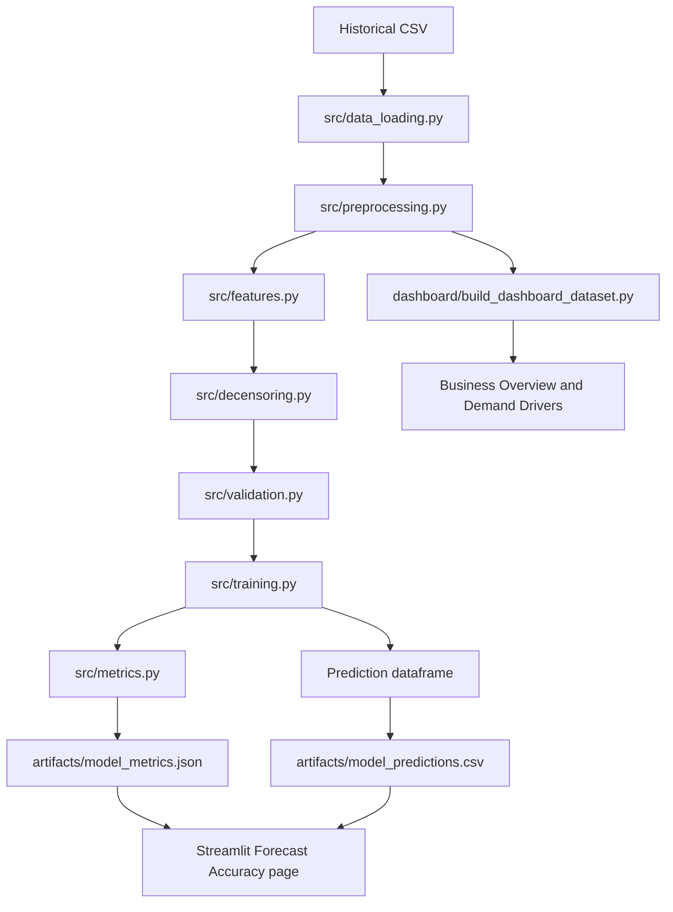

# Current Solution Architecture and Code Guide

This document describes the solution **as it is currently implemented**. It separates the working local prototype from the recommended Google Cloud production target.

## 1. Current end-to-end flow



## 2. Module responsibilities

### `src/data_loading.py`

- `load_data(path)` reads the CSV and parses `timestamp`.
- `validate_schema(df)` verifies required columns and valid timestamps.

The current schema check does not yet validate numeric ranges, duplicates, missing hours or key uniqueness.

### `src/preprocessing.py`

- `clean_data(df)` applies feature-specific missing-value rules.
- `sort_time_series(df)` sorts by store, product and time.
- `add_stockout_flag(df)` creates `is_stockout` when stock is zero or below.
- `time_based_split(df)` provides a generic chronological split helper.

### `src/features.py`

Creates:

- calendar features: `hour`, `day_of_week`, `month`, `is_weekend`;
- price features: `price_diff`, `price_ratio`;
- lags: 1, 24 and 168 hours;
- 24-hour rolling mean and standard deviation.

Lag and rolling features use `shift(1)`, so the current target does not become its own feature. Initial unavailable history is filled with zero, which is a simple cold-start fallback.

### `src/decensoring.py`

`create_demand_proxy(df)` keeps observed sales under normal conditions and uses the greater of observed sales and the recent rolling mean during stock-outs.

This is a conservative business heuristic, not observed ground truth.

### `src/validation.py`

- `get_three_month_backtest_split(df)` uses the last three calendar months as one holdout period.
- `create_naive_baselines(...)` creates previous-hour and previous-day forecasts.
- `evaluate_baselines(...)` calculates baseline MAE and RMSE.
- `future_permutation_test(...)` checks that changing future sales does not alter historical lag and rolling features.

The current validation is one time-based holdout, not multi-fold walk-forward validation.

### `src/training.py`

Defines the model features, trains LightGBM, generates predictions and calls metric evaluation.

Current LightGBM configuration:

```python
lgb.LGBMRegressor(
    objective="regression",
    n_estimators=500,
    learning_rate=0.05,
    num_leaves=31,
    random_state=42,
    n_jobs=-1,
)
```

Training:

```python
model.fit(X_train, y_train)
```

Prediction:

```python
predictions = model.predict(X_test)
```

`train_and_evaluate()` returns:

1. trained model;
2. MAE/RMSE dictionary;
3. dataframe containing `timestamp`, `store_id`, `product_id`, `actual_demand`, `predicted_demand` and `forecast_error`.

The model type is still hardcoded to LightGBM. A configurable model factory remains a future improvement.

### `src/metrics.py`

- `evaluate_predictions(...)` calculates MAE and RMSE.
- `calculate_improvement(...)` calculates percentage improvement over a baseline.

### `src/inference.py`

`predict_demand(...)` is a reusable prediction helper. It is not yet a complete deployed inference service.

### `scripts/run_model_pipeline.py`

This is the executable model pipeline. It:

1. loads and validates source data;
2. cleans and sorts records;
3. creates stock-out flags, features and demand proxy;
4. creates the final three-month holdout;
5. trains LightGBM;
6. evaluates baselines and leakage;
7. saves model metrics and predictions.

Generated artifacts:

```text
artifacts/model_metrics.json
artifacts/model_predictions.csv
```

### `dashboard/build_dashboard_dataset.py`

Builds the historical dataset used by Business Overview and Demand Drivers.

### `app_utils/model_artifacts.py`

Loads and validates the generated metrics and prediction artifacts for the dashboard.

### `app_utils/forecast_charts.py`

Builds the Actual vs Predicted chart with hourly and daily aggregation.

### `views/model_performance.py`

The Forecast Accuracy page displays:

- dynamically loaded MAE and RMSE;
- Actual vs Predicted;
- store and product filters;
- hourly/daily aggregation;
- local MAE, RMSE and forecast bias;
- baseline comparison;
- leakage result;
- business interpretation, limitations and retraining guidance.

## 3. Feature set and target

The current model uses store/product identifiers, weather and event factors, prices, promotion, delivery delay, holidays, app clicks, stock level, calendar variables, price relationships, lags, rolling statistics and stock-out status.

Default target:

```text
demand_proxy
```

## 4. Forecasting scenario

The use of observed lag values inside the holdout is closest to a rolling one-step-ahead scenario in which new sales arrive over time and the next forecast is refreshed.

It is not yet a strict recursive multi-step forecast for an entire future week or month.

## 5. Business meaning of metrics

- **MAE** is the typical forecast miss in product units.
- **RMSE** reacts more strongly to occasional large misses.
- **Forecast bias** shows persistent overforecasting or underforecasting.
- **Baseline improvement** shows value relative to simple planning rules, not direct financial savings.

An MAE of 2.13 means an average difference of about two units for one store-product-hour observation. The practical importance varies by product volume, margin, shelf life and service-level requirements.

## 6. Current strengths

- modular Python code;
- chronological validation;
- shifted lag and rolling features;
- baseline comparison;
- leakage-oriented validation;
- conservative stock-out adjustment;
- reproducible model artifacts;
- dynamic Actual vs Predicted dashboard;
- business-facing metric explanations;
- documented Google Cloud production direction.

## 7. Current limitations

- synthetic data;
- one three-month holdout rather than multi-fold walk-forward validation;
- heuristic demand proxy;
- baseline initialization could be made more rigorous across train/test chronology;
- no recursive long-horizon forecasting;
- manually selected LightGBM parameters;
- LightGBM is not yet selected through a configurable model factory;
- limited cold-start handling;
- no deployed model registry, drift monitoring or automated retraining yet.

## 8. Quick code navigation

| Question | Location |
|---|---|
| Where is data loaded? | `src/data_loading.py::load_data` |
| Where are missing values handled? | `src/preprocessing.py::clean_data` |
| Where are lag features created? | `src/features.py::create_lag_features` |
| Where is demand proxy created? | `src/decensoring.py::create_demand_proxy` |
| Where is the holdout created? | `src/validation.py::get_three_month_backtest_split` |
| Where are baselines evaluated? | `src/validation.py::evaluate_baselines` |
| Where is leakage checked? | `src/validation.py::future_permutation_test` |
| Where is LightGBM created and trained? | `src/training.py` |
| Where are MAE and RMSE calculated? | `src/metrics.py::evaluate_predictions` |
| Where is the complete pipeline run? | `scripts/run_model_pipeline.py` |
| Where are prediction artifacts loaded? | `app_utils/model_artifacts.py` |
| Where is Actual vs Predicted built? | `app_utils/forecast_charts.py` |
| Where is Forecast Accuracy rendered? | `views/model_performance.py` |
