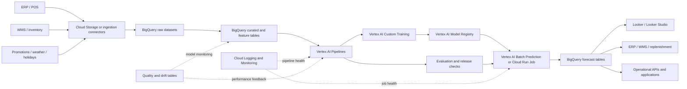
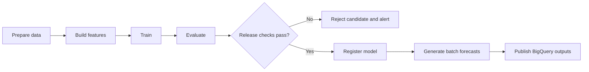

# Production Architecture

This document describes how the current demand forecasting prototype can evolve into a production solution on Google Cloud.

The repository currently contains a modular local Python pipeline, reproducible model artifacts and a Streamlit dashboard. The architecture below is a recommended target state, not a claim that every component is already implemented.

## 1. Business objective

Forecast demand at the Product–Dark Store–Hour level and make approved forecasts available to inventory planning, replenishment, operations and analytics systems.

The production solution should support scheduled forecasts, traceable model versions, reliable storage, monitoring, controlled retraining and integration with ERP, WMS, BI and planning tools.

## 2. Recommended Google Cloud architecture



## 3. Why batch forecasting is the default

Demand planning normally does not require a permanently deployed low-latency endpoint. A scheduled batch process is usually simpler and more cost-efficient.

Recommended default:

- generate forecasts hourly or daily;
- forecast the agreed planning horizon;
- write predictions into BigQuery;
- let downstream systems read the latest approved forecast version.

An online endpoint should be added only when a client system needs synchronous predictions for individual requests.

## 4. Data layer

### Cloud Storage

Use Cloud Storage for raw files, exported training datasets, model and pipeline artifacts, temporary batch inputs/outputs, backups and long-term retention.

### BigQuery

Use BigQuery as the analytical system of record for sales, inventory, prices, promotions, competitor prices, weather, holidays, training datasets, forecasts, metrics and monitoring history.

Suggested datasets:

```text
raw
curated
features
forecasts
monitoring
```

Each forecast record should include at least:

```text
forecast_timestamp
prediction_for_timestamp
store_id
product_id
predicted_demand
model_version
pipeline_run_id
created_at
```

## 5. Feature preparation

Good candidates for BigQuery SQL or Dataform:

- schema normalization;
- source joins;
- calendar dimensions;
- reusable curated tables;
- data-quality assertions.

Good candidates for Python pipeline components:

- model-specific lag and rolling features;
- demand proxy logic;
- training matrices;
- evaluation;
- LightGBM serialization.

For scheduled batch forecasting, versioned BigQuery feature tables may be sufficient. A feature store should be introduced only when its operational benefits justify the added complexity.

## 6. Training and model management

### Vertex AI Custom Training

Package the modular Python pipeline into a reproducible training job that reads a versioned dataset, creates features, evaluates the model and baselines, runs leakage checks, saves metadata and registers an approved model.

### Vertex AI Model Registry

Recommended metadata:

- model version;
- training-data period;
- feature-schema version;
- hyperparameters;
- MAE, RMSE and bias;
- baseline improvements;
- approval status;
- code commit SHA;
- pipeline run ID.

## 7. Orchestration

Use Vertex AI Pipelines for the core ML lifecycle:



For lightweight schedules, Cloud Scheduler can trigger Workflows, Cloud Run Jobs or a Vertex AI Pipeline run.

Use Cloud Composer 3 only when complex Airflow dependencies justify it. Do not design new deployments around Cloud Composer 1.

## 8. Prediction and serving

Preferred batch options:

- Vertex AI Batch Prediction when model packaging and serving containers fit the workflow;
- Cloud Run Jobs when custom Python inference and direct BigQuery writes are operationally simpler.

Use a Vertex AI endpoint or Cloud Run service only when low-latency predictions are required.

## 9. BI and downstream use

### Looker

Recommended when clients need governed metric definitions, LookML, robust access controls, embedded analytics and enterprise administration.

### Looker Studio / Data Studio

Suitable for rapid reporting, prototypes and lightweight self-service dashboards over prepared BigQuery tables.

## 10. Monitoring

Monitor four layers:

- **Pipeline health:** run status, duration, failed steps, missing or stale outputs.
- **Data quality:** schema changes, duplicates, missing hours, invalid values and category changes.
- **Data and prediction drift:** demand, prices, promotions, stock-outs, temperature, app clicks and predicted-demand distributions.
- **Model quality:** MAE, RMSE, bias and segment-level performance after actual demand becomes available.

Use Cloud Logging, Cloud Monitoring, alerting policies and BigQuery monitoring tables.

## 11. Retraining and release policy

Retraining may be scheduled and condition-based. A candidate should be promoted only when it passes data-quality, leakage, performance and business-acceptance checks.

Rollback should keep the previous approved model and forecast version available.

See [`RETRAINING_AND_MONITORING.md`](RETRAINING_AND_MONITORING.md) for the detailed policy.

## 12. Security and governance

Recommended controls include separate environments, least-privilege service accounts, Secret Manager, BigQuery row/column security where needed, audit logging, explicit retention, lineage and private networking for regulated workloads.

## 13. Current implementation versus target state

| Area | Current repository | Recommended production state |
|---|---|---|
| Data source | Local CSV | Cloud Storage and BigQuery |
| Pipeline | Local Python script | Vertex AI Pipeline |
| Training | Local LightGBM | Vertex AI Custom Training |
| Model governance | Local artifacts | Vertex AI Model Registry |
| Prediction | Local script | Scheduled batch prediction |
| Forecast output | CSV artifact | Versioned BigQuery table |
| Dashboard | Streamlit | Streamlit and/or Looker |
| Monitoring | Documented proposal | Cloud Monitoring and quality tables |
| Retraining | Manual | Scheduled and condition-based |

## 14. Product lifecycle notes

The architecture avoids legacy or deprecated components such as Legacy AI Platform services, Vertex AI Feature Store Legacy/V1, deprecated Workbench notebook types and Cloud Composer 1 for new deployments.

The exact Google Cloud product matrix should be reviewed before every client implementation because service names, launch stages and recommended patterns can change.
